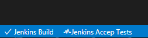
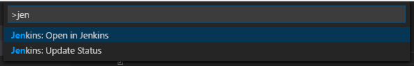

# Functionality

View the Jenkins build status of your project inside Visual Studio Code.



# Installation

Press `F1` in VSCode, type `ext install` and then look for `jenkins`.

# Usage

It is automatically enabled if you have a `.jenkins` file in the root folder of your project. The only required information is the `url` pointing to your Jenkins job. 

If you need _authentication_, just add `username` and `password_or_token` in the `.jenkins` file and you are ready to go.


```json
{
    "url": "http://127.0.0.1:8080/job/myproject",
    "username": "jenkins_user",
    "password": "jenkins_password_or_token"
}
``` 

If you are having trouble with self-signed certificates and your build status says `SELF_SIGNED_CERT_IN_CHAIN`, you could use a _workaroud_ adding a `strictTls` flag to your `.jenkins` file:

```json
    "strictTls": true
```

## Available commands

* **Jenkins: Open in Jenkins:** Open the Jenkins project in you browser 
* **Jenkins: Open in Jenkins (Console Output):** Open the Console Output of the Jenkins project in you browser 
* **Jenkins: Update Status:** Manually update the status of our Jenkins project



## Available settings

* Interval (in minutes) to automatically update the status
```json
    "jenkins.polling": 2
```
> Note: 0 (zero) means _no update_

# Participate

If you have any idea, feel free to create issues and pull requests

# License

[MIT](LICENSE.md) &copy; Alessandro Fragnani

---

[](https://www.paypal.com/cgi-bin/webscr?cmd=_donations&business=EP57F3B6FXKTU&lc=US&item_name=Alessandro%20Fragnani&item_number=vscode%20extensions&currency_code=USD&bn=PP%2dDonationsBF%3abtn_donate_SM%2egif%3aNonHosted) a :coffee: and you will help me to keep working on this extension :wink:

[](https://www.paypal.com/cgi-bin/webscr?cmd=_donations&business=EP57F3B6FXKTU&lc=BR&item_name=Alessandro%20Fragnani&item_number=vscode%20extensions&currency_code=BRL&bn=PP%2dDonationsBF%3abtn_donate_SM%2egif%3aNonHosted) um :coffee: e você vai me ajudar a continuar trabalhando nesta extensão :wink: